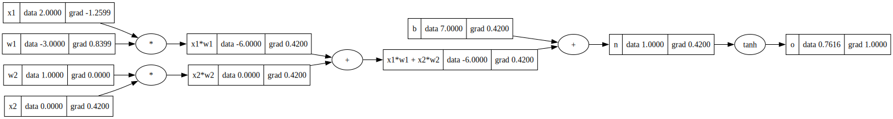
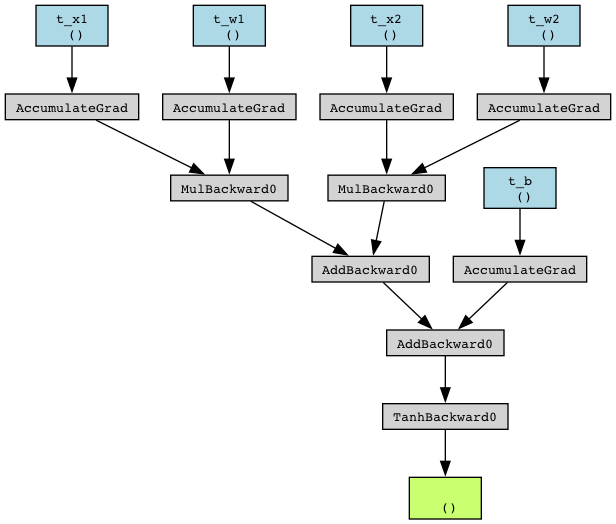

# AutoGrad

My implementation of autograd class like Pytorch.autograd using Numpy

## Notice

I add `if node._prev:` before node._backward since the original codes have a bug when the node is a leaf node.

Here are the plots of my DVG and Pytorch DVG:

Surprisely, my implementation of sclaer-level backpropagation is faster than Pytorch:

TODO

- [X] scaler-based
- [ ] vector-based
- [ ] efficiency

## Reference

- https://medium.com/sfu-cspmp/diy-deep-learning-crafting-your-own-autograd-engine-from-scratch-for-effortless-backpropagation-ddab167faaf5
- https://github.com/karpathy/micrograd
